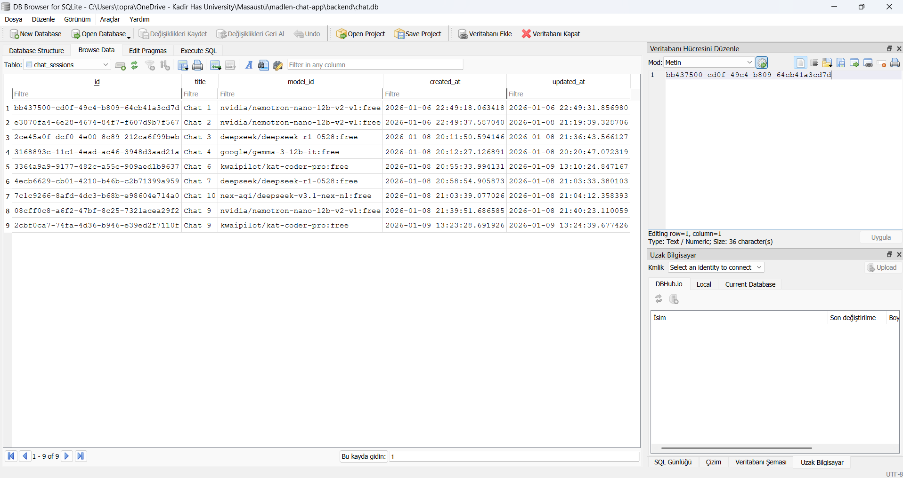
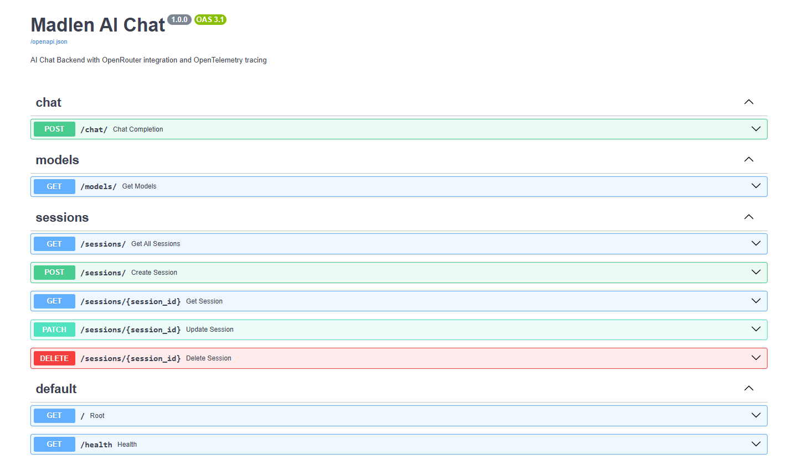

# Madlen AI Chat


A production-ready AI chat application with OpenRouter integration, featuring multiple free AI models, multi-modal support, and comprehensive monitoring with OpenTelemetry and Jaeger.

## Overview

This web-based chat interface allows users to interact with various AI models through OpenRouter. The application supports model selection, chat history management, session persistence, and image uploads for vision-capable models.

**Built for the Madlen case study project - demonstrating modern full-stack development, AI integration, and production-ready monitoring.**

## Key Features

- **10+ Free AI Models** via OpenRouter (automatically filtered)
- **Multi-modal Support** - Image uploads for vision models
- **Smart Model Detection** - Visual indicators for image-capable models
- **Chat History & Sessions** - Persistent conversation management
- **Real-time Responses** - Async architecture for performance
- **Comprehensive Monitoring** - OpenTelemetry + Jaeger integration
- **Professional UI** - React + TypeScript + TailwindCSS
- **Type Safety** - TypeScript frontend, Pydantic backend

## Technology Stack

**Backend:** FastAPI, SQLAlchemy, SQLite, OpenTelemetry, HTTPX  
**Frontend:** React 18, TypeScript, Vite, TailwindCSS, Axios  
**Monitoring:** OpenTelemetry, Jaeger  
**DevOps:** Docker Compose

## Quick Start

### Prerequisites

- Python 3.10+
- Node.js 18+
- Docker Desktop
- OpenRouter API Key ([Get one here](https://openrouter.ai))

### Installation

**1. Clone Repository**

```bash
git clone https://github.com/YOUR_USERNAME/madlen-chat-app.git
cd madlen-chat-app
```

**2. Backend Setup**

```bash
cd backend
python -m venv venv

# Windows:
venv\Scripts\activate
# Mac/Linux:
source venv/bin/activate

pip install -r requirements.txt

# Create .env file with:
OPENROUTER_API_KEY=your_api_key_here
ENABLE_TRACING=True

# Start Jaeger
docker-compose up -d

# Run backend
python -m uvicorn app.main:app --reload
```

Backend: http://localhost:8000

**3. Frontend Setup**

```bash
cd frontend
npm install
npm run dev
```

Frontend: http://localhost:5173

### Access Points

- **Frontend:** http://localhost:5173
- **Backend API:** http://localhost:8000
- **API Docs:** http://localhost:8000/docs
- **Jaeger UI:** http://localhost:16686

## Project Structure

```
madlen-chat-app/
├── backend/              # FastAPI + OpenTelemetry
│   ├── app/
│   │   ├── routes/       # API endpoints
│   │   ├── services/     # Business logic
│   │   ├── telemetry/    # OpenTelemetry setup
│   │   └── models.py     # Database models
│   ├── requirements.txt
│   ├── docker-compose.yml
│   └── README.md         # Backend documentation
│
├── frontend/             # React + TypeScript
│   ├── src/
│   │   ├── components/   # UI components
│   │   ├── services/     # API client
│   │   └── types/        # TypeScript types
│   ├── package.json
│   └── README.md         # Frontend documentation
│
├── screenshots/          # Project screenshots
└── README.md            # This file
```

**Detailed documentation:**
- [Backend Documentation](./backend/README.md)
- [Frontend Documentation](./frontend/README.md)

## API Endpoints

- `GET /models/` - List free AI models with vision support
- `POST /chat/` - Send message and get AI response
- `GET /sessions/` - Get all chat sessions
- `POST /sessions/` - Create new session
- `DELETE /sessions/{id}` - Delete session

**Interactive API Docs:** http://localhost:8000/docs

## Monitoring with Jaeger

**Start Jaeger:**
```bash
cd backend
docker-compose up -d
```

**View Traces:**
1. Open http://localhost:16686
2. Select service: `madlen-chat-backend`
3. Click "Find Traces"

**Available Traces:**
- Chat completions with OpenRouter
- Model fetching
- Session management
- Database operations

## Screenshots

### Application Interface

**Main Chat Screen**

*Chat interface with sidebar, messages, and AI model information*

**Model Selection**

*Smart model selector with vision indicators and context length*

**Image Upload**

*Multi-modal chat with image upload capability*

### Docker Deployment

**Running Container**

*Jaeger container running in Docker Desktop*

**Docker Image**

*Jaeger all-in-one image ready for deployment*

**Container Logs**

*Real-time Jaeger logs showing trace ingestion*

### Database

**SQLite Database**

*Chat sessions and messages stored in SQLite database*

### API Documentation

**Interactive API Docs (Swagger UI)**

*Auto-generated interactive API documentation with all endpoints*

### Monitoring

**Jaeger Trace List**

*Distributed traces from madlen-chat-backend service*

**Trace Details**

*Detailed span view showing request flow and timing*

## Key Features Implementation

### 1. Smart Model Filtering

Only free models are displayed to prevent accidental paid usage:

```python
free_models = [m for m in all_models 
               if m["pricing"]["prompt"] == "0"]
```

### 2. Vision Support Detection

Automatic detection of image-capable models:

```python
supports_vision = "image" in model["architecture"]["input_modalities"]
if supports_vision:
    model["name"] = f"📷 {model['name']}"
```

### 3. Session Persistence

All messages automatically saved to SQLite database with cascade delete.

### 4. Comprehensive Error Handling

User-friendly error messages throughout the application with proper logging and tracing.

## Technical Decisions

### Why FastAPI?
- Native async/await for high performance
- Automatic API documentation
- Type safety with Pydantic
- Modern Python features

### Why React + TypeScript?
- Component-based architecture
- Type safety prevents runtime errors
- Excellent developer experience
- Production-ready ecosystem

### Why SQLite?
- Zero configuration
- Single-file portability
- Sufficient for local use
- Easy PostgreSQL migration

### Why OpenTelemetry + Jaeger?
- Industry standard for observability
- Vendor-neutral distributed tracing
- Essential for debugging
- Production-grade monitoring

## Project Evaluation

### Developer Experience
-  One-command setup with clear documentation  
-  Cross-platform support (Windows, Mac, Linux)  
-  Hot reload for rapid development  
-  Docker Compose for consistent environments  

### User Experience
-  Professional, intuitive interface  
-  Real-time feedback (loading, errors)  
-  Smooth animations and transitions  
-  Responsive design  

### Code Quality
-  TypeScript + Pydantic for type safety  
-  Clean separation of concerns  
-  Comprehensive error handling  
-  Async/await throughout  

### Additional Features
-  Smart free model filtering  
-  Vision model detection  
-  Model information display  
-  Image persistence in database  
-  Optimistic UI updates  

## Environment Configuration

**Backend (.env):**
```env
OPENROUTER_API_KEY=your_key_here
ENABLE_TRACING=True
DATABASE_URL=sqlite:///./chat.db
JAEGER_ENDPOINT=http://localhost:4317
```

**Frontend (.env):**
```env
VITE_API_BASE_URL=http://localhost:8000
```

## Development

**Backend:**
```bash
python -m uvicorn app.main:app --reload --log-level debug
```

**Frontend:**
```bash
npm run dev
```

## Troubleshooting

**Backend won't start:**
```bash
# Check port
netstat -ano | findstr :8000
# Verify venv
python --version
```

**Jaeger connection errors:**
```bash
# Check Docker
docker ps
# Restart Jaeger
docker-compose restart
```

**OpenRouter API errors:**
- Verify API key in `.env`
- Check rate limits
- Ensure internet connection

## Deployment

**Production Checklist:**
- Set `DEBUG=False`
- Use PostgreSQL instead of SQLite
- Configure proper CORS origins
- Set up SSL/TLS
- Use production ASGI server (Gunicorn + Uvicorn)

## Future Enhancements

- User authentication (JWT ready)
- Multi-user chat rooms
- Message reactions and editing
- Export chat history
- Streaming responses
- Voice input/output
- Custom model parameters

## Contributing

This is a case study project demonstrating modern full-stack development practices. Contributions welcome for educational purposes.

## License

MIT License - See [LICENSE](./LICENSE) file for details

**Developed as a case study for Madlen - demonstrating production-ready AI integration, comprehensive monitoring, and modern full-stack architecture.**
